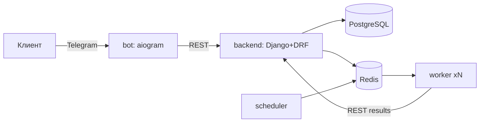

# SPEC — Парсер/мониторинг объявлений → Telegram

Дата: 2026-01-21

## 0) Цель
Сделать сервис 24/7, который мониторит новые объявления по ссылке (категория + город) и отправляет уведомления в Telegram.

Ключевые требования из ТЗ:
- Мониторинг новых объявлений по ссылке.
- Тарифы частоты: 1–10 запросов/сек на клиента.
- Быстрое уведомление в TG (минимальная end-to-end задержка).
- Масштабирование минимум на 150 клиентов.
- Стабильность 24/7 месяцами.
- Дедупликация (не присылать одно и то же повторно).
- Исходники передаются после оплаты/этапа.
- После ядра: простая админка + касса + бот (обсуждаем/делаем после стабильного парсера).

Важно: источники типа Avito могут иметь антибот-защиты и ToS. В этой версии спецификации фиксируем «инженерную» архитектуру и механизмы надежности/масштабирования; любые методы обхода защит — отдельно согласуются, потому что это влияет на легальность, риски блокировок и себестоимость.

---

## 1) Архитектура (высокий уровень)
### Компоненты
- **backend (Django + DRF + Admin)**
  - Хранение пользователей/тарифов/подписок/ссылок.
  - API для бота/воркеров.
  - Дедуп по базе (гарантия, что дублей не будет даже после рестартов).
- **scheduler**
  - Планировщик, который кладет задачи «проверить ссылку» в очередь согласно тарифу.
  - Справедливое распределение (fair scheduling) между пользователями.
- **worker (воркеры-парсеры)**
  - Берут задачи из очереди, выполняют HTTP-запрос, парсят результаты.
  - Выделяют новые объявления и отправляют их в backend.
- **bot (Telegram bot на aiogram)**
  - Интерфейс клиента: добавить/удалить ссылку, выбрать тариф, включить/выключить.
  - Получает события и отправляет уведомления.
- **redis**
  - Очередь задач.
  - Быстрый дедуп «в моменте».
  - Rate-limit счетчики.
- **postgres**
  - Источник истины (users, subscriptions, links, items, events).

### Потоки данных
1) Клиент добавляет ссылку и тариф через бота → backend сохраняет подписку.
2) scheduler генерирует задачи по тарифам → кладет их в Redis очередь.
3) worker забирает задачу → делает запрос → парсит → отправляет результаты в backend.
4) backend сохраняет новые item’ы/события (с дедупом) → ставит событие уведомления.
5) bot отправляет сообщение в TG.

---

## 2) Визуализация (Mermaid)

---

## 3) Структура репозитория (папки/файлы)

Корень:
- `docker-compose.yml` — поднимает Postgres/Redis/backend/scheduler/worker/bot.
- `.env.example` — пример переменных окружения.
- `.gitignore` — игноры.
- `SPEC.md` — этот документ (эталон структуры и плана).

Сервисы:
- `backend/` — Django + DRF
  - `Dockerfile`, `requirements.txt`
  - `manage.py`
  - `config/` — settings/urls/wsgi
  - `api/` — минимальный пример API (`/api/v1/health/`)
- `scheduler/` — планировщик задач (пока заглушка heartbeat)
  - `Dockerfile`, `requirements.txt`, `main.py`
- `worker/` — воркер задач (пока заглушка heartbeat)
  - `Dockerfile`, `requirements.txt`, `main.py`
- `bot/` — Telegram-бот (минимальный старт)
  - `Dockerfile`, `requirements.txt`, `main.py`

---

## 4) Почему такой стек
- **Django 5.x**: быстрый старт админки через Django Admin + надежная ORM + миграции.
- **DRF**: стандартный REST для интеграции бота и воркеров.
- **Redis**: дешевые очереди и быстрый кэш/дедуп.
- **PostgreSQL**: надежная база для истории и дедупа на уровне уникальных индексов.
- **Docker Compose**: воспроизводимый запуск на любом VPS.

---

## 4.1) Масштабируемость ядра (обязательное требование)
Цель этого раздела — зафиксировать, что ядро проектируется так, чтобы его можно было **горизонтально масштабировать** без переписывания архитектуры.

### Принципы
- **Stateless-сервисы**: `scheduler`, `worker`, `bot` не хранят важное состояние локально. Любое состояние — в Postgres/Redis.
- **Очереди как граница масштабирования**: задания и уведомления проходят через Redis-очереди. Это позволяет добавлять/убирать воркеры без изменения логики.
- **Идемпотентность**:
  - Повторная обработка одного и того же задания не должна приводить к повторной рассылке.
  - Дедуп гарантируется на уровне БД уникальным ключом `(subscription_id, item_id)`.
- **Rate limiting**:
  - Пер-подписка/пер-пользователь: строго по тарифу (1–10 rps).
  - Глобальный лимит на источник (защита от лавины ошибок/банов).
- **Fair scheduling**: быстрые тарифы получают приоритет, но ни один пользователь не должен «съедать» очередь.
- **Наблюдаемость**: метрики очередей/задержек/ошибок должны быть доступны, иначе high-load поддерживать невозможно.

### Что масштабируется горизонтально
- `worker`: масштабируется N-контейнерами (`docker compose up --scale worker=N`).
- `scheduler`: обычно 1 экземпляр (для простоты), либо несколько с лидер-выбором (позже).
- `bot`: 1 экземпляр на polling; при переходе на webhook можно масштабировать (позже).
- `backend`: масштабируется как stateless web-app, если вынести миграции/админку в отдельный процесс (позже).

### Технические обязательства реализации (для этапов B–F)
- Уникальные индексы для дедупа и быстрых выборок.
- Очереди/задачи должны иметь `job_id` и быть повторяемыми без побочных эффектов.
- Все сетевые запросы: таймауты, ретраи с backoff, лимит параллелизма.
- Метрики: минимум `queue_depth`, `job_latency_ms`, `requests_total`, `errors_total`.

---

## 5) Инфраструктура (как запускаем)
### 5.1. Локально/на сервере
1) Создать `.env` из примера:
   - скопировать `.env.example` → `.env` и заполнить `BOT_TOKEN`.
2) Запуск:
   - `docker compose up --build`
3) Проверка:
   - backend health: `http://localhost:8000/api/v1/health/`

### 5.2. Масштабирование воркеров
- `docker compose up --scale worker=10` (пример)

---

## 6) Пошаговый план реализации (чтобы не отходить)

### Этап A — Инфраструктура (готово)
- Docker Compose
- Postgres/Redis
- backend (Django) каркас
- scheduler/worker/bot каркасы

### Этап B — Данные и API (следующий)
1) Модели в Postgres (через Django models + миграции):
   - User (встроенный)
   - TariffPlan (rps_limit)
   - Subscription (user, link, plan, enabled)
   - Item (source item_id/url/title/price/published_at)
   - SeenItem / Event (subscription_id + item_id + sent_at)
   - Индексы/уникальности для дедупа: уникальный ключ (subscription_id, item_id)
2) REST эндпоинты:
   - `POST /api/v1/subscriptions/` (создать)
   - `PATCH /api/v1/subscriptions/{id}/` (вкл/выкл, тариф)
   - `GET /api/v1/subscriptions/` (для админки/бота)
   - `POST /api/v1/worker/report/` (воркер сообщает результаты)

### Этап C — Scheduler (тарифы 1–10 rps, справедливость)
- Реализовать алгоритм token bucket или next_run_at per subscription.
- Очередь в Redis: например `queue:checks`.

### Этап D — Worker (HTTP fetch + parsing)
- Реализовать клиент очереди (BRPOP/Streams).
- HTTP клиент (httpx), таймауты, ретраи.
- Парсинг конкретного источника — отдельный модуль (адаптер).

### Этап E — Bot UX
- Команды: /start, добавить ссылку, выбрать тариф, включить/выключить.
- Нотификации: формат (title/price/url).

### Этап F — Надежность 24/7
- Логи, метрики, алерты (опционально Prometheus/Grafana).
- Рестарты, backoff, дедуп.

---

## 7) Критерии готовности «ядра парсера»
- Система запускается одной командой (Compose).
- Бот принимает ссылку и включает подписку.
- Scheduler кладет задания согласно тарифу.
- Worker отрабатывает задания, backend фиксирует новые items.
- Уведомления уходят в Telegram.
- Дедуп работает (один item → одно уведомление на подписку).
- После перезапуска дублей нет.
 - Масштабирование `worker` линейно улучшает пропускную способность в разумных пределах (при неизменной логике).

---

## 8) Что НЕ делаем до ядра
- Касса/платежи.
- Расширенная админка (кроме Django Admin).
- Оптимизации уровня «high-load продакшн» (k8s, autoscaling, tracing) — только если после ядра нужно.
